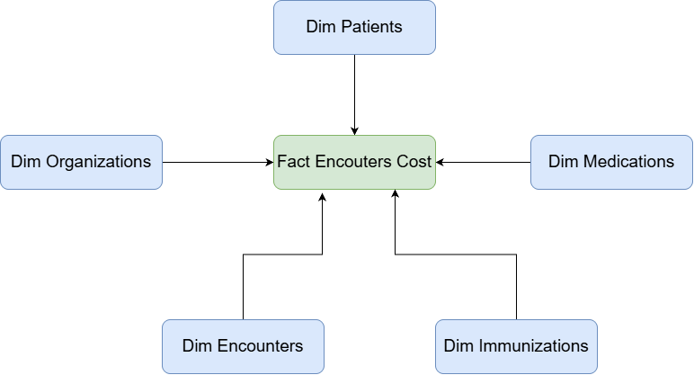
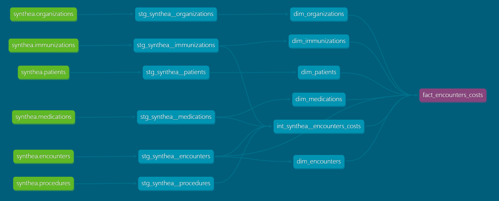

# Synthea dbt Project

A small project made with the goal to practice the fundamentals of DBT, creating a source file, referencing tables, creating tests, documentation and data lineage.
DuckDB was chosen to store the data it can be easilly reproduced with a local infrastructure.

## Notes

- All patient data is synthetic (generated by Synthea) — no real patient information is used.
- `dev.duckdb` and the local `profiles.yml` are generated locally and are not committed to version control.

## Stack

- **dbt-core** for transformation, testing, and documentation
- **DuckDB** as the local analytical database (no server to run or maintain)
- **Python** for the raw data loading step

## Project structure

```
synthea-project/
├── scripts/
│   ├── load_raw_data.py       # loads Synthea CSVs into DuckDB (raw schema)
│   ├── setup_profile.ps1      # copies/merges the dbt profile (Windows)
│   └── setup_profile.sh       # copies/merges the dbt profile (macOS/Linux)
├── seed_data/
│   └── synthea/csv/           # raw Synthea CSV files
├── seeds/                     # small reference tables loaded via `dbt seed`
├── models/
│   ├── staging/                # 1:1 cleaned models over each raw source
│   └── marts/                  # dimension and fact models (star schema)
├── profiles.yml.example       # template copied into ~/.dbt/profiles.yml
├── dbt_project.yml
├── .gitignore
└── README.md
```

## How to reproduce

1. Clone this repository.
2. Download and unzip the synthea.rar file with sample dataset and place it under `csv/`.
3. Create and activate a Python virtual environment, then install dependencies:
   ```
   pip install dbt-duckdb duckdb
   ```
4. Set up the local dbt profile (safe to run even if you already have other dbt profiles on this machine):
   - Windows (PowerShell): `.\scripts\setup_profile.ps1`
   - macOS/Linux: `./scripts/setup_profile.sh`
5. Load the raw CSVs into DuckDB:
   ```
   python synthea/scripts/load_raw_data.py
   ```
6. Install dependencies:
   ```
   dbt deps
   ```
7. Build all models:
   ```
   dbt run
   ```
8. Run the data tests:
   ```
   dbt test
   ```
9. Generate and view the documentation site:
   ```
   dbt docs generate
   dbt docs serve
   ```

## Data model

- **Staging**: `stg_encounters`, `stg_immunizations`, `stg_medications`, `stg_organizations`, `stg_patients`, `stg_procedures`
- **Dimensions**: `dim_encounters`, `dim_immunizations`, `dim_medications`, `dim_organizations`, `dim_patients`, `dim_procedures
- **Interdemdiate**: `int_encounters_costs`
- **Facts**: `fact_encounters_costs`
- **Star Schema**:



## Lineage

